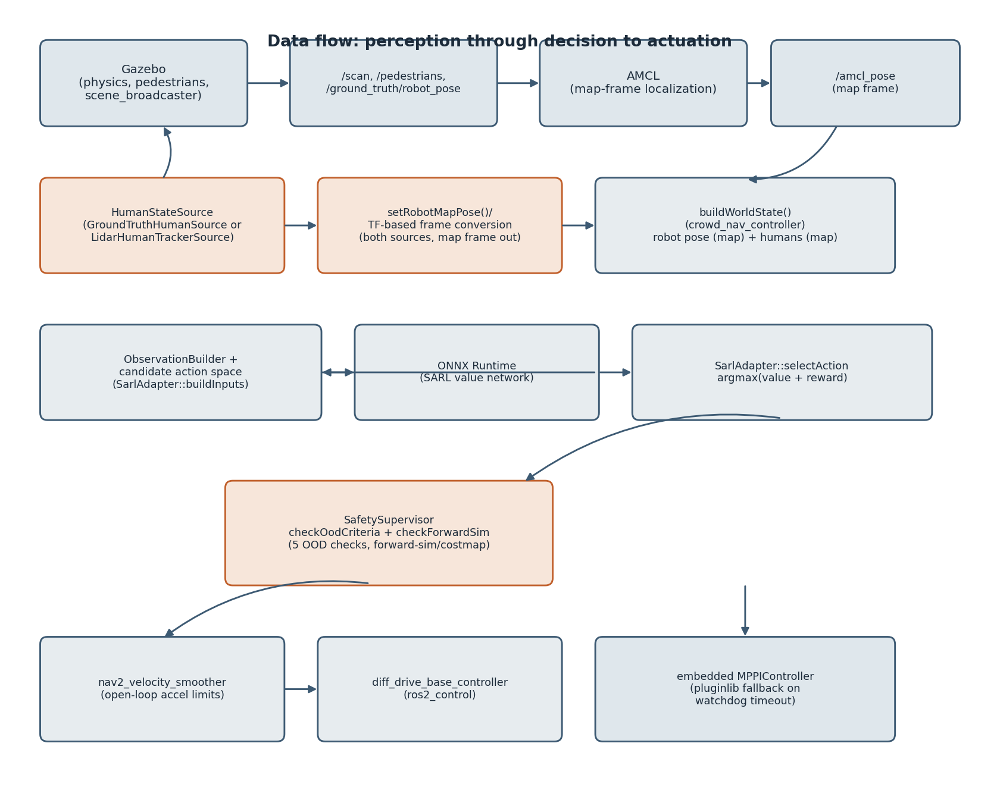
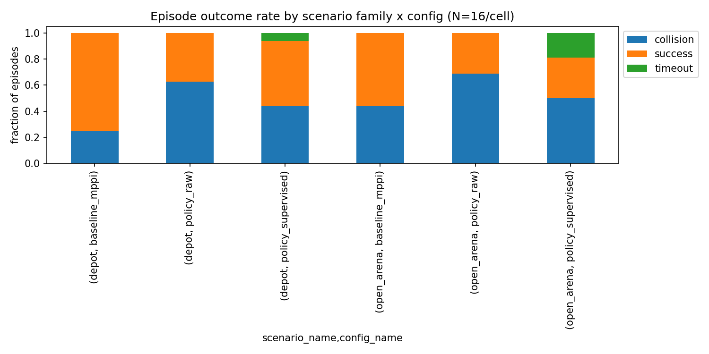
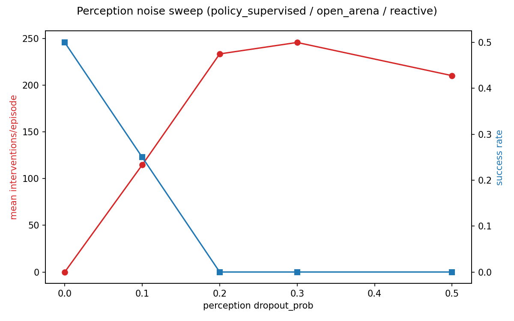
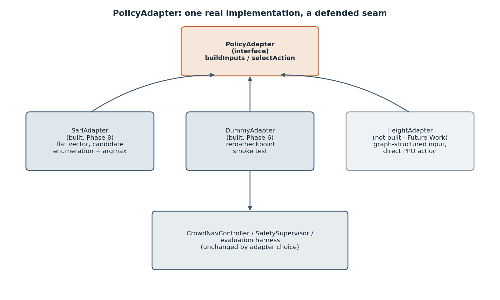

<div align="center">

# Safety-Supervised Runtime for Learned Crowd Navigation on ROS 2 Nav2

**A hard safety layer around a learned crowd-navigation policy — forward-simulated
collision checking, 5-criteria out-of-distribution detection, and graceful fallback to a
classical controller — evaluated with a 142-episode matrix and reported honestly, wins and
losses both.**

[](https://docs.ros.org/en/humble/)
[](https://docs.nav2.org/)
[](https://gazebosim.org/)
[](https://onnxruntime.ai/)
[](https://en.cppreference.com/w/cpp/17)
[](LICENSE)

[Overview](#overview) ·
[Results](#results-what-the-safety-supervisor-actually-does) ·
[Architecture](#architecture) ·
[Demo](#demo--screenshots) ·
[Getting Started](#getting-started) ·
[Docs](#documentation-map)

</div>

---


## Overview

A learned crowd-navigation policy (SARL) is fast to imitate human-like avoidance behavior and
easy to break outside the geometry it trained on. This project doesn't try to make the policy
safer — it wraps an unmodified policy in a **runtime supervisor** that checks every candidate
action before it reaches the robot, and hands off to a classical MPPI controller the instant
the policy's own behavior or its inputs look untrustworthy. It runs as a single
[`nav2_core::Controller`](https://docs.nav2.org/plugin_tutorials/docs/writing_new_nav2controller_plugin.html)
plugin, alongside the stock Nav2 stack, on a diff-drive robot in Gazebo.

The interesting part isn't "the policy works" — it's the **139-episode evaluation matrix**
(`docs/phase10-findings.md`) this project ran against its own claims, including a hard
adversarial audit (`docs/audit.md`) that found a critical coordinate-frame bug, reversed the
headline collision-rate result, and is reported here without smoothing it over. The supervisor
is perfect against a static hazard, closes a real safety gap against dynamic ones, and saturates
rather than compensates once its own perception degrades — three honest findings, not one clean
win.

## Architecture

<p align="center">
  
</p>

One control tick, end to end: `CrowdNavController::computeVelocityCommands()` builds a
`WorldState` from the current Nav2-supplied pose and live human perception, runs the configured
`PolicyAdapter` inside a 30&nbsp;ms watchdog on a background thread, and — only if that returns
in time — runs `SafetySupervisor`'s cheap out-of-distribution checks first, then a 4-step,
1.0&nbsp;s forward-simulated collision/keepout check against the live costmap. A pass returns the
policy's candidate; a supervisor rejection returns a direct stop and logs an `InterventionEvent`;
a watchdog timeout defers to an embedded `nav2_core::Controller` fallback (stock MPPI, loaded via
`pluginlib`) running only on the main thread. Everything shares one costmap pointer and one
control tick — the supervisor structurally sees what the rest of the stack sees, not a
synchronized copy of it.

The policy, the supervisor, and the fallback controller are three genuinely separate pieces of
logic sharing one plugin instance — deliberately, so a rejection can never race a fallback call
into the same controller object (`docs/lessons.md`).

## Results: what the safety supervisor actually does

> These results were corrected after a hard adversarial audit found a critical coordinate-frame
> bug that silently fed the policy — not just the supervisor — human positions offset by several
> meters from their real location, for the entire time this project ran a live Gazebo episode
> (`docs/audit.md` §1.3). The full 142-episode matrix was re-run against the fix; the numbers
> below are the corrected result, and the reversal is documented, not hidden — see
> `docs/phase10-findings.md`'s **CORRECTION** section for the full before/after.

Three results, run together, describe one pattern: **the supervisor takes a raw learned policy
that is measurably less safe than a classical baseline under real conditions, and restores it to
match the baseline — while remaining perfect against a static hazard and honest about where its
own margin runs out.**

<p align="center">
  
</p>

| Scenario | What it shows |
|---|---|
| **Static keepout zone** (`depot_keepout_block`) | The supervisor's forward-sim check rejects the identical unsafe approach **439/439 times — zero violations.** The raw policy drives straight into the zone; the MPPI baseline routes a 6.4 m detour via Nav2's own planner (the supervisor has no planner, so it gets stuck rather than reroute — the honest limit of "refusal" as a strategy). |
| **Reactive pedestrians** (fairest comparison) | Raw policy collision rate is **50%**, worse than the classical MPPI baseline's **12%** — an honest, unflattering measurement. The supervised policy closes the gap to **12%**, matching baseline. Two residual collisions are each caught within a quarter second of contact — a margin limit, not a detection gap. |
| **Perception noise sweep** (`dropout_prob` 0.0→0.5) | A sharp, reproducible cliff between 0.0 and 0.1, then flat through 0.5 — even as the true probability of losing a human keeps climbing. The supervisor doesn't get better at catching an already-confused policy; it saturates. |

<p align="center">
  
</p>

Full evidence chain, including two harness bugs found and fixed mid-phase and the hard-audit
correction above: **`docs/phase10-findings.md`** (evaluation detail), **`docs/audit.md`** (the
audit itself).

## Demo & Screenshots

The plots above are real, regenerated data. The GUI captures below are not included in this
repository yet — see [`docs/images/README.md`](docs/images/README.md) for the exact,
ready-to-drop-in list (filenames, what each should show, and the exact commands to reproduce the
scenario). Once a file lands at the path shown, uncomment its block below — no further edits
needed, the syntax is already correct.

<!--
<p align="center">
  
  <br><em>Full run: supervised policy navigating a crowd of reactive pedestrians.</em>
</p>

<table>
<tr>
<td width="50%"></td>
<td width="50%"></td>
</tr>
<tr>
<td align="center"><em>Gazebo: depot world, robot among pedestrians</em></td>
<td align="center"><em>RViz: costmap, live human tracks, planned path</em></td>
</tr>
</table>

<p align="center">
  
  <br><em>A real intervention: the supervisor rejects a candidate action and stops.</em>
</p>

<p align="center">
  
  <br><em>Keepout zone: the supervisor's forward-sim check rejecting the identical unsafe
  approach, over and over, at the zone boundary.</em>
</p>
-->

## Perception: two selectable human-state sources

<p align="center">
  
</p>

Every result above was measured against `GroundTruthHumanSource` — a deliberate isolation tool
(it separates a policy-logic bug from a perception bug), not a claim about real-robot
performance, and `docs/phase10-findings.md` says so without softening it.
A second, real implementation now exists and is the default:
**`LidarHumanTrackerSource`** clusters the robot's own `/scan` returns (adaptive-breakpoint
clustering with full-circle wraparound handling), tracks clusters frame-to-frame with
exponential velocity smoothing, and converts to the map frame via TF — no ground truth involved.
Auditing it found and fixed three real bugs (a TF-timeout segfault; an angular-wraparound gap in
the clustering that split a person straddling the scan's 0°/360° seam into two humans; the
depot's static pillars falling inside the geometric human-width filter and getting misclassified
as people, fixed with a minimum-displacement gate — a track has to actually move before it counts
toward `CROWD_SIZE`/`PROXIMITY` or reaches the policy). Full writeup:
**`docs/lidar_perception-findings.md`**.

Switch between them with one launch argument — `human_source_type:=ground_truth` or
`lidar_tracked` (default) — see [Getting Started](#getting-started). The 142-episode matrix
above is explicitly pinned to `ground_truth` so the historical results stay reproducible;
rerunning it against `lidar_tracked` is the single most valuable next measurement
(`docs/lidar_perception-findings.md`) and has not been done yet.

## `PolicyAdapter`: one real implementation, a deliberately defended seam

`PolicyAdapter` (`crowd_nav_policy_adapters/include/crowd_nav_policy_adapters/policy_adapter.hpp`)
is a 4-method interface — `expectedShape()`, `buildInputs(WorldState)`, `selectAction(...)`,
`name()` — with one production implementation, `SarlAdapter`, plus `DummyAdapter` (a
zero-checkpoint smoke test for the inference path, not a second policy family). SARL is a
**value network**, not a direct policy net: `buildInputs()` enumerates a discretized candidate
action space, one-step-propagates the world state under each candidate, and batches SARL's flat
observation vector per candidate; `selectAction()` runs argmax over the batch's value-network
output plus an immediate-reward term. None of that candidate-search machinery lives in the
interface — it's private to `SarlAdapter`.

A second real adapter (HEIGHT — a graph-structured, PPO-trained policy family) is deliberately
scoped as separate follow-on work, not folded in here: its only available checkpoint is
author-provided but unverified, and this project already has a precedent for why that deserves
real skepticism (a different RL-trained SARL checkpoint failed validation outright at 0.21
success against a paper-reported 0.99). See [Future Work](#future-work).

## Repository Structure

```
crowd_nav_ws/src/
├── crowd_nav_bringup            Top-level Nav2 bringup: AMCL/SLAM launch, costmap/planner config
├── crowd_nav_controller         nav2_core::Controller plugin: watchdog, adapter dispatch, MPPI fallback
├── crowd_nav_safety_supervisor  OOD detector (5 criteria) + forward-sim collision/keepout check
├── crowd_nav_policy_adapters    PolicyAdapter interface, SarlAdapter, DummyAdapter
├── crowd_nav_observation        Canonical WorldState / HumanObservation + ObservationBuilder
├── crowd_nav_perception         HumanStateSource: GroundTruthHumanSource, LidarHumanTrackerSource
├── crowd_nav_pedestrians        Deterministic seeded social-force pedestrian simulation
├── crowd_nav_zones              Dynamic keep-out zones (AddZone/RemoveZone → costmap filter mask)
├── crowd_nav_evaluation         Scenario suite, harness runner, metrics, CSV + plots
├── crowd_nav_gazebo             World files and robot spawn launch
├── crowd_nav_description        URDF/xacro digital twin of the target robot
├── crowd_nav_control            ros2_control config: sim hardware interface today, ESP32 later
└── crowd_nav_onnxruntime_vendor Vendored ONNX Runtime CPU release as a CMake target
```

## Getting Started

**Requirements:** Ubuntu 22.04, ROS 2 Humble, Gazebo (Ignition Fortress / `gz-sim` 6.18), CycloneDDS.

```bash
# CycloneDDS, not the ROS 2 default FastRTPS — a real reliability fix, see Known Limitations.
export RMW_IMPLEMENTATION=rmw_cyclonedds_cpp

# Build
cd crowd_nav_ws
rosdep install --from-paths src --ignore-src -r -y
colcon build --symlink-install
source install/setup.bash
```

**Run the full stack** (Gazebo + Nav2 + the supervised policy, in three terminals — `amcl.launch.py`
doesn't launch RViz itself, so it's a separate step):

```bash
# Terminal 1 — robot, Nav2, safety-supervised SARL controller (defaults: depot world, LiDAR-tracked perception)
ros2 launch crowd_nav_bringup amcl.launch.py

# Terminal 2 — a deterministic, seeded crowd of reactive pedestrians
ros2 launch crowd_nav_pedestrians pedestrians.launch.py

# Terminal 3 — RViz, pointed at Nav2's own stock config (this project uses unmodified
# Nav2 node/topic names, so it works with no project-specific RViz config needed)
rviz2 -d /opt/ros/humble/share/nav2_bringup/rviz/nav2_default_view.rviz
```

Wait for Terminal 1 to print `Managed nodes are active`, then send a goal from RViz's "2D Goal
Pose" toolbar button, or via CLI (`ros2 topic pub -1 /goal_pose geometry_msgs/msg/PoseStamped
"{header: {frame_id: 'map'}, pose: {position: {x: 2.0, y: 0.0, z: 0.0}, orientation: {w: 1.0}}}"`).
Useful launch arguments on `amcl.launch.py`: `adapter_type:=sarl|dummy`,
`supervisor_enabled:=true|false`, `human_source_type:=lidar_tracked|ground_truth`,
`perception_dropout_prob:=<0.0-1.0>`.

**Run the evaluation matrix** (142 seeded episodes, ~reproduces `docs/phase10-findings.md`):

```bash
cd crowd_nav_ws/src/crowd_nav_evaluation/scripts
python3 run_matrix.py
```

**Run tests + lint:**

```bash
colcon test --packages-select crowd_nav_controller crowd_nav_safety_supervisor \
  crowd_nav_policy_adapters crowd_nav_perception crowd_nav_observation crowd_nav_zones
colcon test-result --verbose
```

## Known Limitations

Stated deliberately, not discovered as accidents.

- **The simulated LiDAR is 180° FOV, not 360°.** A confirmed gz-sim 6.18.0 rendering bug causes
  spurious self-hits across half the scan; masked at the source, at the honest cost of a real
  FOV reduction. The clustering algorithm was made FOV-agnostic with full-circle wraparound
  handling anyway, since the real target sensor is a genuine 360° scanner. (`docs/phase1-findings.md`)
- **The SARL checkpoint is imitation-learning-only, not RL-refined** — the available RL-trained
  alternative failed validation outright (0.21 success vs. a paper-reported 0.99). Chosen
  deliberately: a bad-but-RL-trained base policy would have made "the supervisor caught something
  unsafe" indistinguishable from "the supervisor is compensating for a bad policy." (`docs/phase0-findings.md`)
- **Every number in Results was measured against ground-truth perception, not real sensing.** A
  real, non-ground-truth alternative (`LidarHumanTrackerSource`) now exists, is wired in, and is
  live-verified — but the 142-episode matrix has not yet been re-run against it. See
  [Perception](#perception-two-selectable-human-state-sources) above.
- **The OOD detector characterizes world-state novelty, not input-pipeline correctness** — none
  of its five criteria can tell that an observation was already wrong before any threshold looked
  at it. Three real bugs of exactly that class were found in this project, none of them by tuning
  a threshold — by differential testing and live adversarial verification.
- **CI has not yet run on GitHub infrastructure.** What *is* verified locally: the full
  unit-test suite and lint gate run clean (91 tests, 0 failures), and the nightly smoke test's
  own pass/fail logic was verified against both a real episode and a synthetic failing case.
  What's unverified is the GitHub-Actions-specific provisioning around it (Gazebo/Xvfb setup on
  a fresh runner, dependency caching).

## Future Work

Ranked by how directly each follows from a finding already in this report — not a wishlist:

1. **Re-run the 142-episode matrix against `LidarHumanTrackerSource`** — the single most direct
   next measurement; every current result is ground-truth-only.
2. **Map-differencing against the already-loaded static map, as a second layer on top of the
   minimum-displacement gate already shipped** — the gate closes the live-observed
   pillar-misclassification finding for the common case (pillars don't move; simulated
   pedestrians do, quickly), but map-differencing is the more principled, sensor-agnostic check
   and would also catch any other permanently-static, human-width object the gate's threshold
   doesn't happen to suit.
3. **A real-hardware LiDAR calibration pass** — every clustering/tracking parameter is currently
   sized against the simulated sensor, not real noise characteristics.
4. **HEIGHT integration** — a second, genuinely RL-trained, graph-structured policy family;
   scoped as its own effort pending checkpoint validation, not folded into this backlog.
5. **Close the detection-margin gap** the collision-rate result surfaced — the OOD proximity
   threshold and forward-sim lookahead are inherited from the training config, never re-tuned
   against this robot's real depot dynamics.
6. **A physical robot.** The entire project is built around one explicit hardware-abstraction
   seam (an ESP32-based `ros2_control` interface) that has never been built.

## Documentation Map

| Document | What's in it |
|---|---|
| **`docs/audit.md`** | The hard adversarial audit that found the coordinate-frame bug and reversed the headline result. |
| **`docs/phase10-findings.md`** | Full evaluation-matrix detail, including the post-audit CORRECTION section. |
| **`docs/lidar_perception-findings.md`** | The real, non-ground-truth LiDAR perception pipeline: design, two bugs found and fixed, live verification. |
| **`docs/lessons.md`** | Transferable engineering lessons from the project, independent of this specific codebase. |
| **`docs/phase0-findings.md`** … **`phase11-findings.md`** | Per-phase findings logs — every bug found, how it was verified, as it landed. |
| **** | The living implementation plan: phase-by-phase design decisions and final status. |

## Acknowledgments

Builds on [`vita-epfl/CrowdNav`](https://github.com/vita-epfl/CrowdNav) (SARL, MIT-licensed) and
a fork providing a pretrained checkpoint; on [Nav2](https://github.com/ros-navigation/navigation2)
for planning, costmaps, and the controller plugin interface this entire project is built around;
and on [ROS 2](https://www.ros.org/) and [Gazebo](https://gazebosim.org/).

## License

MIT — see [`LICENSE`](LICENSE). Upstream dependencies (Nav2, ROS 2, Gazebo) retain their own
licenses; see `LICENSE` for the exact lineage of the CrowdNav-derived policy code.
